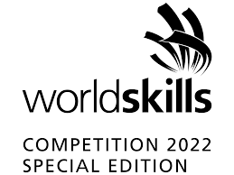

<h1 align="center">
    
</h1>

# CML
> Cisco Modelling labs configurations for the Worldskills 2022 Korea Special Edition round

> Note Missing:

> Routing tasks (load balancing)

> WAN & LAN tasks(tunnel IKEv2, anyconnect vpn)

## NOTE:

> This is a work in progress, and is not complete. It is not guaranteed to work, and is not supported by Cisco.

To install this program, please import the yaml files into the cml
the topology yaml is a blank copy for those who just want to kick start their adventures!

## Background

This is a simulated office environment of networks done in cisco modeling labs. It is to showcase the worldskills 2022 korea special edition round.

## Special Thanks
Yong En & Sze Yan for helping to contribute to the success and adventures of our cisco project.

Mr Yang Yu for supporting us and sitting down with us to bug hunt cisco issues

